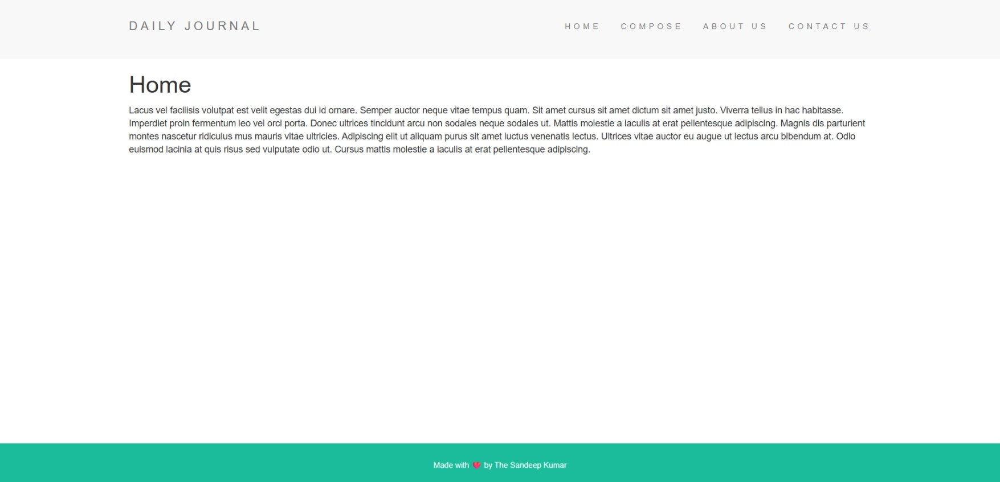
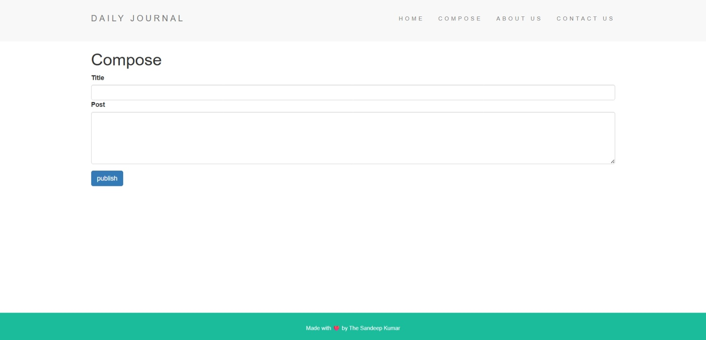
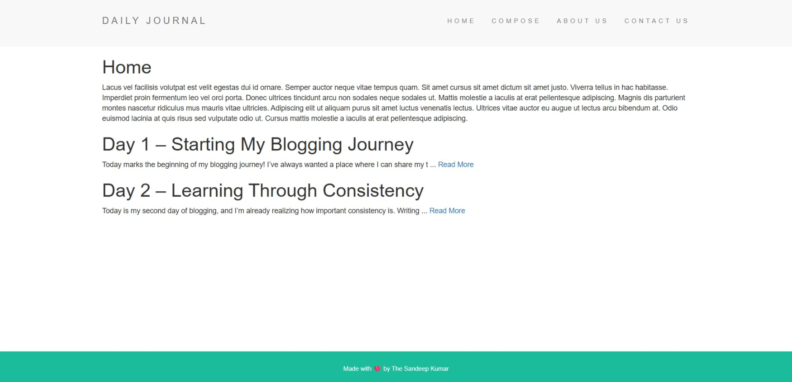
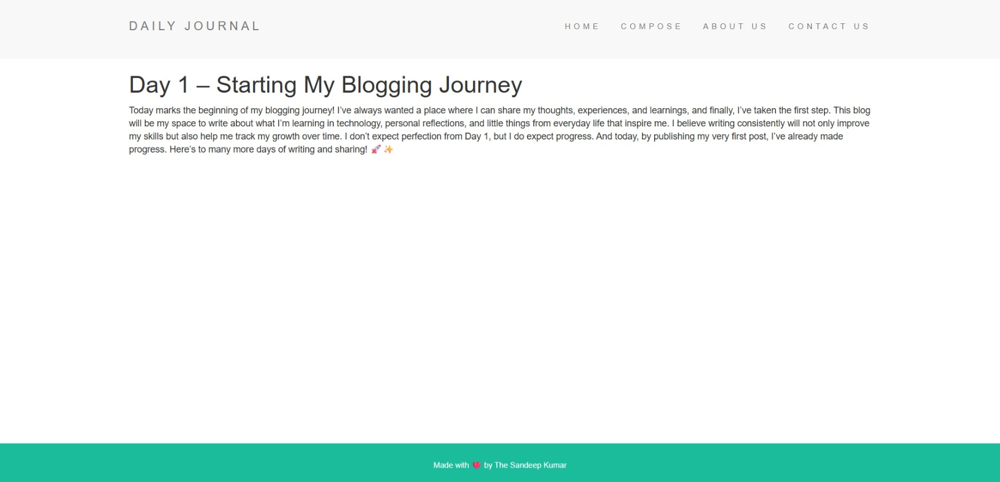

# Blog Website

A simple blog website built with Node.js, Express, and EJS.

## Sample output of Website
This is home page without any posts.<br>


This is compose page.<br>


This is home page with posts.<br>


This is post page.<br>


## Prerequisites

- Node.js and npm installed on your machine.

## Installation

1. Clone the repository or download the source code.
2. Open a terminal in the project directory.
3. Install the dependencies:
   ```bash
   npm install
   ```

## Running the Application

1. After the installation is complete, you can start the server with the following command:
   ```bash
   npm start
   ```
2. Open your web browser and navigate to `http://localhost:3000`.
